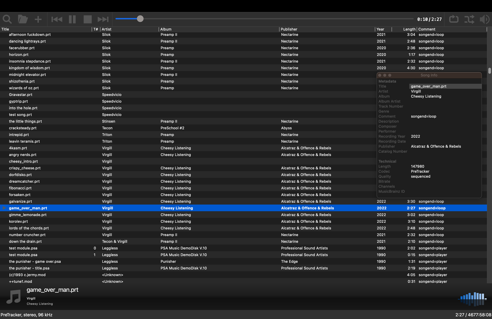
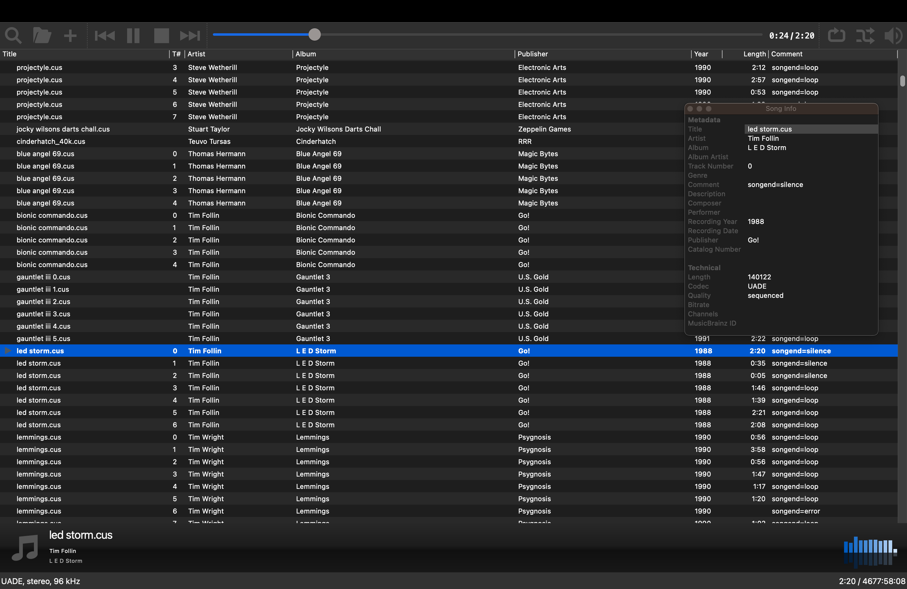
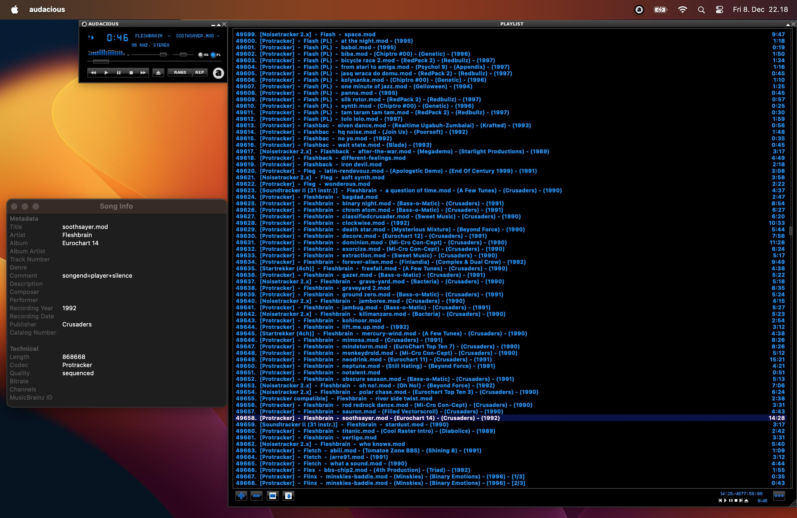

# Audacious UADE Plugin

This is Audacious (https://audacious-media-player.org/) and DeaDBeeF (https://deadbeef.sourceforge.io/) input plugin for UADE (https://zakalwe.fi/uade/) and other retro music replays.

No binaries are currently provided, but support for common Linux, *BSD, macOS and Haiku package managers is available (see [Installation via Package Managers](#installation-via-package-managers)).
For installing on Windows, see https://github.com/mvtiaine/audacious-uade/issues/45#issuecomment-2727591702

Project is hosted at https://github.com/mvtiaine/audacious-uade  
Songdb tools are at https://github.com/mvtiaine/audacious-uade-tools

## Screenshots

<p align="center">
  <a href="screenshots/screenshot1.png"></a>
  <a href="screenshots/screenshot2.png"></a>
  <a href="screenshots/screenshot3.png"></a>
</p>

## IMPORTANT!

- Make sure "Probe content of files with no recognized file name extension" setting is **enabled** and "Guess missing metadata from filepath" setting is **disabled** in Audacious prefs in order for subsongs and meta data to work properly. The playlist must also have been created **after** the settings are applied.
- Also after updating to a new version, it's a good idea to regenerate old playlists to avoid potential issues.

## Main Features

- Precalculated database for song lengths and author/album/publisher/year meta data (see [Songdb sources](#songdb-sources))
- Player independent songend detection (similar to "deep songend scan" option in DeliPlayer for Windows)
- Preferences UI for configuring UADE playback options etc.
- Custom fork of UADE (https://gitlab.com/mvtiaine/uade) including support for additional formats and platforms not (yet) supported in official UADE releases:
  - Face The Music
  - OctaMED Soundstudio / MMD3
  - Protracker4 / Protracker IFF
  - Support for AmigaOS (and related), Windows (MSYS2/MinGW), ...
- MED4 sng+samples format support via MED4->MMD0 conversion
- DigiBooster 3 and DigiBooster Pro 2 support (http://www.digibooster.de/)
- HivelyTracker support (http://www.hivelytracker.co.uk/)
- Fasttracker 1 & 2 support (https://github.com/8bitbubsy/ft2play)
- Scream Tracker 2 support (https://pastebin.com/ifXSCZ71)
- Scream Tracker 3 support (https://pastebin.com/AwRXZAw7)
- Impulse Tracker 1 & 2 support (https://github.com/8bitbubsy/it2play)
- ProTrekkr 1 & 2 support (https://github.com/hitchhikr/protrekkr)
  - Note: older ProTrekkr mods may play incorrectly
- NoiseTrekker 2 support based on sources from the final release
- libopenmpt support (optional) (https://lib.openmpt.org/libopenmpt/)
- libxmp support (optional) (https://xmp.sourceforge.net/)

## Other Notes

- Case sensitive filesystems may cause issues for formats with external samples
- Tested on 64-bit, 32-bit, big & little endian hosts. Tested on macOS, Linux, DragonFly*/Free*/Net*/OpenBSD, Haiku, Windows (MinGW*/MSYS2, Cygwin), OpenIndiana, GNU Hurd. Libraries/CLI binaries also tested on AmigaOS3, MorphOS, AROS, QNX 6.5.0, AIX, cosmocc, Tizen, Meego/Sailfish, OS/2 (ArcaOS)
- Build support (binaries not tested) for Android, iOS, Fuchsia, OpenHarmony, webOS, RISC OS, FreeMiNT, WarpOS, Redox OS, SerenityOS, Genode, BlackBerry 10, QNX 7, QNX 8, PS4 (OpenOrbis)
- WIP support (runtime failures) for IRIX, AmigaOS4, Wasix, Emscripten, UnixWare.
- Recommended custom Audacious playlist entry/window title template:
  ```
  ${?codec:[${codec}${?channels: (${channels}ch)}]}  -  ${?artist:${artist}  -  }${title}${?album: - (${album})} ${?copyright:-  (${copyright})}${?publisher:- (${publisher}) }${?year:- (${year}) }${?subsong-id:${?subsong-num:- [${subsong-id}/${subsong-num}]}}
  ```
- Audacious metadata available: Artist, Album, Publisher, Year, Track, Length, Comment
- DeaDBeeF metadata available: Track Number, Artist, Album, Year, Duration, Codec, %publisher%, %channels%, %player%, %songend%

## Future Plans (in no particular order)

- Automatic A500/A1200/None filter selection depending on format/year/platform (OCS/AGA/DOS) etc. meta data
- Plugin support for GStreamer, Hollywood, ...
- Support more platforms
- Add more replays
- PTK-Prowiz converter support (portable C-version)
- Improve UADE format support and portability
- Improve songdb with more coverage and metadata sources
- Project might need a new name...

## License

**Source code and data files**  
The project as a whole is licensed under GPL-2.0-or-later. See COPYING for license text.

Some parts are also licensed under LGPL-2.1-or-later, specifically sources under `src/common/`, `src/converter/`, `src/player/` and `src/songdb/`. See COPYING.LGPL for license text.

Songdb (`conf/songdb`) is licensed under CC BY-NC-SA 4.0.

See NOTICE for 3rd party source code licenses (sources under `src/3rdparty/`).  
See `uade/COPYING` for UADE license information (sources under `uade/`).

## Songdb sources

Modland (http://ftp.modland.com/), AMP (https://amp.dascene.net/), UnExoticA (https://www.exotica.org.uk/wiki/UnExoticA), ExoticA (old) (http://old.exotica.org.uk/), Mods Anthology (https://archive.org/details/cdrom-amiga-mods-anthology-1), Wanted Team (http://wt.exotica.org.uk/) and Demozoo (https://demozoo.org/) are used as sources for precalculated song lengths and author/album/publisher/year meta data (if available).

In addition Zakalwe (git://zakalwe.fi/chip) and Aminet (https://aminet.net/) are used as sources for precalculated song lengths.

## Dependencies (optional/auto detected)

- Audacious >= 3.8
- DeaDBeeF >= 1.8.0
- libopenmpt >= 0.6.0
- libxmp >= 4.5.0

## Build and Install from Source

### Requirements
- **Required (git or release)**: pkg-config, GNU make, GCC/Clang with C++17 support (GCC-6+, Clang-5.0+)
- **Required (git)**: autoconf, automake, libtool

### Latest Release
Download and extract the `audacious-uade-<version>.tar.bz2` file from https://github.com/mvtiaine/audacious-uade/releases

### Git
```bash
# NOTE: running `libtoolize` before `autoreconf` may be needed on some platforms
git clone --depth 1 --shallow-submodules --recurse-submodules https://github.com/mvtiaine/audacious-uade.git
autoreconf -i
```

### Build and Install
```bash
# NOTE: see ../configure --help for build options
# NOTE: DeaDBeeF plugin support may require adjusting CPPFLAGS and --with-deadbeef-plugindir as it does not use pkg-config
# NOTE: gmake is required on some platforms
mkdir -p build
cd build
../configure
make -j check
sudo make install
```

## Installation via Package Managers

### Homebrew (Latest Release)
```bash
# NOTE: DeaDBeeF support not available with Homebrew install (TODO)
brew install mvtiaine/repo/audacious-uade
```

**macOS:**
```bash
ln -s "${HOMEBREW_PREFIX}/lib/audacious/Input/uade.dylib" "$(pkgconf --variable=plugin_dir audacious)/Input/uade.dylib"
```

**Linux:**
```bash
ln -s "${HOMEBREW_PREFIX}/lib/audacious/Input/uade.so" "$(pkgconf --variable=plugin_dir audacious)/Input/uade.so"
```

### Gentoo Overlay (Latest Release)
```bash
# Add https://github.com/mvtiaine/gentoo-overlay.git via layman or eselect repository
emerge -p media-plugins/audacious-uade
emerge media-plugins/audacious-uade
```

### Arch/Manjaro PKGBUILD
```bash
# (optional) install libxmp from AUR https://aur.archlinux.org/packages/libxmp
# (optional) install DeaDBeeF from AUR https://aur.archlinux.org/packages/deadbeef

# Latest release
wget https://raw.githubusercontent.com/mvtiaine/arch-repo/main/audacious-uade/PKGBUILD
makepkg -s
sudo pacman -U audacious-uade*.pkg*

# Git
makepkg -c -s -f -D scripts
sudo pacman -U scripts/audacious-uade*.pkg*
```

### FreeBSD/MidnightBSD/DragonFlyBSD Ports (Latest Release)
```bash
# NOTE: DeaDBeeF support not available with ports install (too old version)
git clone https://github.com/mvtiaine/freebsd-ports.git
cd freebsd-ports/multimedia/audacious-uade
make install clean
```

### HaikuPorter (Latest Release)
```bash
# NOTE: DeaDBeeF support not available with HaikuPorter install (not in haikuports)
pkgman install audacious audacious_plugins
git clone https://github.com/mvtiaine/haikuports.git
cp -rp haikuports/* /boot/home/haikuports/
haikuporter audacious_uade
pkgman install /boot/home/haikuports/packages/audacious_uade-*
```

### Alpine aports (Latest Release)
```bash
# (optional) install deadbeef and deadbeef-dev packages for DeaDBeeF plugin support
wget https://raw.githubusercontent.com/mvtiaine/aports/main/audacious-uade/APKBUILD
abuild -r
sudo apk add "${HOME}/packages/*/*/audacious-uade*.apk"
```

### MacPorts (Latest Release)
```bash
# (optional) install with +deadbeef variant for DeaDBeeF plugin support
git clone https://github.com/mvtiaine/macports.git <path>
# Add file://<path> to ${prefix}/etc/macports/sources.conf
# see https://guide.macports.org/#development.local-repositories
sudo port sync
sudo port install audacious-uade
```

### pkgsrc (Latest Release)
```bash
# NOTE: DeaDBeeF support not available with pkgsrc install (TODO)
# change /usr/pkgsrc to correct pkgsrc location below as needed
git clone https://github.com/mvtiaine/pkgsrc.git
cp -rp pkgsrc/* /usr/pkgsrc/
cd /usr/pkgsrc/audio/audacious-uade
make install clean clean-depends
```

### OpenBSD Ports (Latest Release)
```bash
# NOTE: DeaDBeeF support not available with ports install (TODO)
git clone https://github.com/mvtiaine/openbsd-ports.git
cp -rp openbsd-ports/* /usr/ports/
cd /usr/ports/audio/audacious-uade
make install clean
```

### Debian/Ubuntu (Git or Latest Release)
```bash
# Debian: (optional) install deadbeef and deadbeef-plugins-dev from https://www.deb-multimedia.org/
# Ubuntu: (optional) install deadbeef and deadbeef-plugins-dev from https://launchpad.net/~spvkgn/+archive/ubuntu/deadbeef
scripts/make_deb.sh
sudo dpkg -i build-deb/audacious-uade*.deb
```

### Fedora/openSUSE (Git or Latest Release)
```bash
# NOTE: with CentOS, EPEL repo is required, DeaDBeeF and libxmp support not available
# add --with-deadbeef for DeaDBeeF support (requires RPM Fusion repo on Fedora)
scripts/make_rpm.sh
sudo dnf install build-rpm/rpmbuild/RPMS/*/*.rpm
# or: sudo yum install build-rpm/rpmbuild/RPMS/*/*.rpm
# or: sudo zypper install build-rpm/rpmbuild/RPMS/*/*.rpm
```

